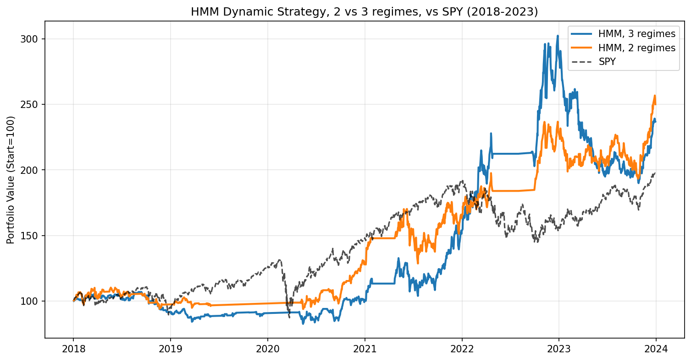

# Regime-Switching Factor Investing with Hidden Markov Models

A simplified replication of Wang, Lin & Mikhelson (2020), *Regime-Switching Factor Investing
with Hidden Markov Models*, Journal of Risk and Financial Management 13(12), 311.

A Gaussian Hidden Markov Model detects the market regime from S&P 500 (SPY) daily returns and
10-day volatility. Every day from January 2018 the model is re-estimated on the previous 2,707
trading days and the portfolio switches between factor strategies built from the Kenneth French
data library: with 3 regimes Bull → Carhart, Neutral → AQR, Bear → Cash; with 2 regimes
Bull → Carhart, Bear → Cash.

## Results, January 2018 – December 2023

| Strategy | CAGR | Volatility | Sharpe | Max drawdown | Info ratio | Final value (start = 100) |
|---|---|---|---|---|---|---|
| HMM, 3 regimes | 15.5% | 22.8% | 0.66 | −37.2% | 0.13 | 236.9 |
| HMM, 2 regimes | 16.5% | 20.2% | 0.76 | −24.5% | 0.16 | 250.1 |
| SPY | 12.0% | 20.4% | 0.56 | −33.7% | – | 196.9 |

Time in each strategy: 3 regimes Carhart 31%, AQR 36%, Cash 34%; 2 regimes Carhart 62%,
Cash 38%.



## Repository

```
src/
  data_loader.py       SPY data and features (daily return, 10-day volatility)
  hmm_model.py         MarketHMM class (hmmlearn GaussianHMM)
  factor_analysis.py   Fama-French factors and strategy performance by regime
  backtester.py        daily re-estimated HMM backtest (n_components = 2 or 3)
notebooks/
  run_all.ipynb        in-sample regimes, backtests with 2 and 3 regimes, comparison
data/                  Fama-French daily files (SPY is downloaded with yfinance if missing)
results/               charts and comparison table
```

## How to run

```bash
pip install -r requirements.txt
jupyter notebook notebooks/run_all.ipynb
```

Each backtest re-estimates the HMM about 1,500 times and takes a few minutes.
## Limitations

- **Not directly investable.** Factor strategies add long–short factors to the market: they
  imply leverage and ignore trading, shorting and rebalancing frictions.
- **No transaction costs.** Every switch between strategies is free; the 3-regime version,
  which switches more often, would be affected the most.
- **One short sample.** Six years of out-of-sample data with one crash (2020) and one bear
  market (2022): a few switches around those episodes drive most of the result.
- **Parameters not tested for robustness.** Window length (2,707 days), number of EM
  iterations, confidence thresholds and the regime-to-strategy map are fixed; other choices
  could give different results.

## Conclusions

- **Both versions beat SPY over 2018–2023.** The 2-regime strategy returned 16.5% a year and
  the 3-regime strategy 15.5%, against 12.0% for SPY, with Sharpe ratios of 0.76 and 0.66
  against 0.56.
- **The simpler model works better.** With 2 regimes the strategy has a higherA return, lower
  volatility (20.2% against 22.8%) and a much smaller maximum drawdown (−24.5% against
  −37.2%; SPY −33.7%). Two states are estimated from more observations each, and the switch
  is a simple choice between momentum exposure (Carhart) and cash.
- **The Bear regime is the one that matters.** In-sample (2007–2017), every factor strategy has
  a negative Sharpe ratio in the Bear regime, and the momentum-heavy ones lose the most
  (Carhart −1.36 with 2 regimes, −1.78 with 3). Moving to cash in that regime is what
  protects the portfolio: the 2-regime strategy is in cash 38% of the days.
- **The Neutral regime adds little.** With 3 regimes the middle state has Sharpe ratios close
  to zero for all strategies (0.06–0.44), so the extra regime mostly adds switching without a
  clear edge.

Overall, the backtest suggests that regime information can improve a factor portfolio,
mainly by avoiding high-volatility periods; given the limitations above, it does not show
that the outperformance would persist.

*For educational purposes only. Not investment advice.*
